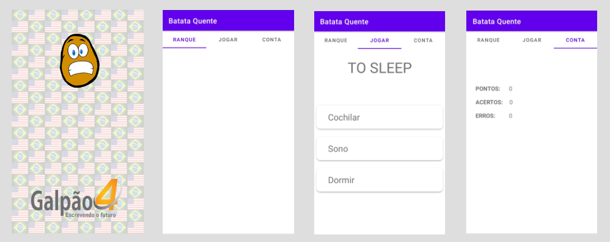

<h1 align="center">Batata Quente</h1>

  

## Project

Mobile application (Android native application) to help enrich vocabulary in the English language in a playful way. Project developed for completion of a technical course in computer science. 

## Features

- Use REST API;
- Randomly ordered options;
- Earn and lose points according to the selected option;
- Conta screen refresh with BroadcastReceiver;
- Splash screen with animations;
- Checks internet connection;

## Technologies and Libraries

This project was developed with the following technologies/libraries:

- Java SE Development Kit 11.0.11
- [Android Studio 2020.3.1 Patch 3](https://developer.android.com/studio/)
- Android SDK Build-Tools 33-rc3
- Android Emulator 31.2.8
- Android Emulator Hypervisor Driver for AMD Processors 1.8.0
- Android SDK Plataform-Tools 33.0.0
- Google Play services 49
- Gradle 7.0.3
- [XAMPP 7.3.31](https://www.apachefriends.org/)

## Mobile devices used in development

- Android (Physical): API 27
- Android (Emulator): API 30

## Layout

  

## Database

  

## How to run

- Clone repository;
- Create a `batata_quente_api` folder in `C:\xampp\htdocs\`;
- Copy files from `...repository\api\` to  `C:\xampp\htdocs\batata_quente_api\`;
- Open XAMPP Control Panel;
- Start Apache and MySQL;
- Click in "Admin" button from MySQL;
- Create one database and import file `...repository\database\batata_quente.sql` to database created;
- Access `...repository\app_mobile\app\src\main\java\com\example\batataquente\util\HttpHelper.java`;
- Change the IP to your computer's IP;
- Run app (You can run app in the your physical smathphone or android emulator);

## License

This project is under the MIT license. See the [LICENSE](LICENSE.md) file for more details.